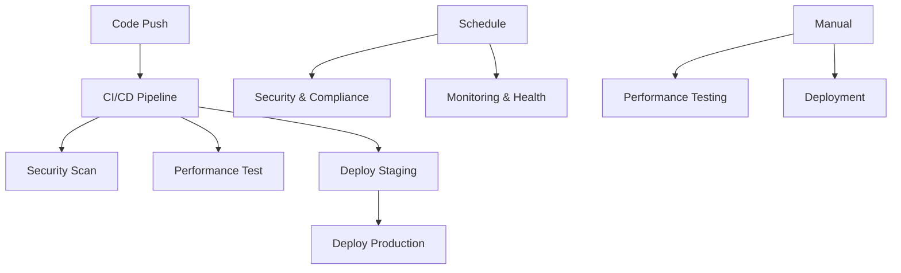

# 🚀 GitHub Actions Workflows - User Microservice

This directory contains comprehensive GitHub Actions workflows for the User microservice, providing enterprise-grade CI/CD, security, monitoring, and deployment automation.

## 📋 Available Workflows

### 1. 🚀 CI/CD Pipeline (`ci.yml`)
**Triggers**: Push/PR to main/develop branches
**Purpose**: Complete continuous integration and deployment pipeline

**Jobs**:
- **Code Quality & Security**: SpotBugs analysis, OWASP dependency check
- **Tests & Coverage**: Unit tests with MySQL, JaCoCo coverage reporting
- **Integration Tests**: Full integration testing with database
- **Build & Package**: Maven build, Docker image creation and push
- **Security Scan**: Trivy vulnerability scanning
- **Deploy Staging**: Automatic deployment to staging environment
- **Deploy Production**: Automatic deployment to production environment
- **Cleanup**: Artifact and resource cleanup

### 2. 🛡️ Security & Compliance (`security.yml`)
**Triggers**: Daily schedule (3 AM UTC), manual dispatch, push events
**Purpose**: Comprehensive security analysis and compliance checking

**Jobs**:
- **SAST Analysis**: CodeQL and Semgrep static analysis
- **Dependency Scan**: OWASP and Snyk vulnerability scanning
- **Container Scan**: Trivy and Hadolint Docker security analysis
- **Secrets Detection**: TruffleHog and GitLeaks secret scanning
- **License Check**: License compliance verification
- **Security Summary**: Consolidated security reporting

### 3. ⚡ Performance Testing (`performance.yml`)
**Triggers**: Manual dispatch, scheduled runs
**Purpose**: Performance benchmarking and load testing

**Jobs**:
- **Load Testing**: JMeter-based performance tests
- **Memory Profiling**: JVM memory analysis
- **CPU Profiling**: Performance bottleneck identification
- **Database Performance**: Query performance analysis

### 4. 📊 Monitoring & Health (`monitoring.yml`)
**Triggers**: Scheduled health checks, manual dispatch
**Purpose**: Continuous monitoring and alerting

**Jobs**:
- **Health Checks**: Service availability monitoring
- **Metrics Collection**: Performance metrics gathering
- **Log Analysis**: Error pattern detection
- **Synthetic Tests**: End-to-end transaction monitoring

### 5. 🚀 Deployment (`deploy.yml`)
**Triggers**: Workflow call from other workflows
**Purpose**: Reusable deployment workflow for different environments

**Jobs**:
- **Pre-deployment**: Validation and planning
- **Deploy**: Kubernetes deployment with health checks
- **Smoke Tests**: Post-deployment verification
- **Post-deployment**: Reporting and notifications

## 🔧 Setup Requirements

### 1. Repository Secrets
Configure the following secrets in your GitHub repository:

```bash
# Container Registry
GITHUB_TOKEN                 # Automatically provided by GitHub

# Kubernetes Deployment
KUBE_CONFIG                  # Base64 encoded kubeconfig file

# Security Scanning
SNYK_TOKEN                   # Snyk API token (optional)
GITLEAKS_LICENSE            # GitLeaks license (optional)

# Notifications (optional)
SLACK_WEBHOOK_URL           # Slack notifications
TEAMS_WEBHOOK_URL           # Microsoft Teams notifications
```

### 2. Environment Configuration
Set up the following environments in your repository:
- `staging` - Staging environment with protection rules
- `production` - Production environment with approval requirements

### 3. Required Files
Ensure these configuration files exist:
- `owasp-suppressions.xml` - OWASP dependency check suppressions
- `license-header.txt` - License header template
- Kubernetes manifests (generated automatically by deploy workflow)

## 🎯 Workflow Features

### ✅ Code Quality
- **Static Analysis**: SpotBugs, CodeQL, Semgrep
- **Test Coverage**: JaCoCo with 50% minimum coverage requirement
- **Code Style**: Automated formatting and linting

### 🛡️ Security
- **SAST**: Static application security testing
- **Dependency Scanning**: Vulnerability detection in dependencies
- **Container Security**: Docker image vulnerability scanning
- **Secrets Detection**: Prevent credential leaks
- **License Compliance**: Open source license verification

### 🚀 Deployment
- **Multi-Environment**: Staging and production deployments
- **Blue-Green**: Zero-downtime deployment strategy
- **Health Checks**: Automated service health verification
- **Rollback**: Automatic rollback on deployment failures

### 📊 Monitoring
- **Performance**: Load testing and profiling
- **Health Monitoring**: Continuous availability checks
- **Metrics**: Application and infrastructure metrics
- **Alerting**: Automated notifications on failures

## 🔄 Workflow Dependencies



## 📈 Coverage Goals

Current coverage: **31%**
Target coverage: **50%** minimum

### Coverage by Package:
- **Entity**: 100% (User, Role classes)
- **DTO**: 81% (Request/Response objects)
- **Config**: 70% (Configuration classes)
- **Service**: 25% (Business logic - needs improvement)
- **Controller**: 15% (REST endpoints - needs improvement)
- **Security**: 20% (Authentication/Authorization - needs improvement)

## 🚨 Alerts and Notifications

### Automatic Issue Creation
Workflows automatically create GitHub issues for:
- Security vulnerabilities (high/critical)
- Deployment failures
- Coverage drops below threshold
- Performance regressions

### Notification Channels
- **GitHub Issues**: Automatic issue creation
- **Pull Request Comments**: Test results and coverage reports
- **Slack/Teams**: Real-time notifications (if configured)

## 🛠️ Customization

### Environment Variables
Modify workflow environment variables:
```yaml
env:
  JAVA_VERSION: '17'
  MAVEN_OPTS: '-Xmx1024m'
  SERVICE_NAME: 'user-service'
  REGISTRY: ghcr.io
```

### Coverage Thresholds
Adjust coverage requirements in `pom.xml`:
```xml
<limit>
    <counter>LINE</counter>
    <value>COVEREDRATIO</value>
    <minimum>0.50</minimum>
</limit>
```

### Security Policies
Update `owasp-suppressions.xml` for security exceptions
Configure branch protection rules for production deployments

## 📚 Best Practices

1. **Branch Strategy**: Use feature branches with PR reviews
2. **Testing**: Write tests before pushing code
3. **Security**: Regular dependency updates
4. **Monitoring**: Monitor deployment health
5. **Documentation**: Keep workflows documented and updated

## 🔍 Troubleshooting

### Common Issues:
1. **Build Failures**: Check Java version and dependencies
2. **Test Failures**: Verify database connectivity
3. **Security Scans**: Review suppressions file
4. **Deployment Issues**: Check Kubernetes configuration
5. **Coverage Drops**: Add missing tests

### Debug Commands:
```bash
# Local testing
mvn clean test jacoco:report
mvn dependency:tree
docker build -t user-service .

# Kubernetes debugging
kubectl logs -f deployment/user-service
kubectl describe pod <pod-name>
```

## 📞 Support

For workflow issues or questions:
1. Check workflow logs in GitHub Actions
2. Review this documentation
3. Create an issue with the `workflow` label
4. Contact the DevOps team

---

**Last Updated**: $(date)
**Version**: 1.0.0
**Maintainer**: DevOps Team