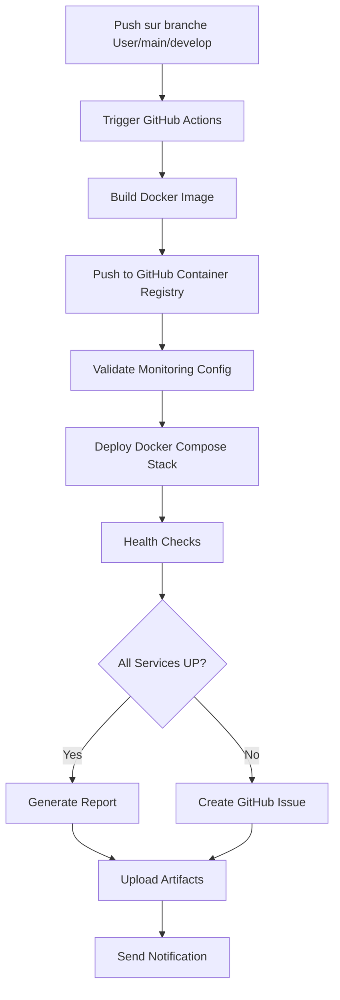

# 🚀 Déploiement Automatique du Monitoring

## 📌 Vue d'Ensemble

Le stack de monitoring (Prometheus, Grafana, Alertmanager) est **automatiquement déployé** à chaque push sur les branches configurées grâce à GitHub Actions.

---

## ⚙️ Configuration Automatique

### Déclenchement Automatique

Le workflow `.github/workflows/deploy-monitoring.yml` se déclenche automatiquement lors de :

#### 1. Push sur les Branches
```yaml
branches:
  - User
  - main
  - master
  - develop
```

#### 2. Modification des Fichiers de Monitoring
```yaml
paths:
  - 'monitoring/**'
  - 'docker-compose-monitoring.yml'
  - '.github/workflows/deploy-monitoring.yml'
  - 'src/**'
```

#### 3. Déclenchement Manuel
Via l'interface GitHub Actions avec choix de l'environnement :
- development
- staging
- production

---

## 🔄 Processus de Déploiement

### Étape 1 : Build Docker Image
1. ✅ Checkout du code
2. ✅ Configuration JDK 17
3. ✅ Build Maven (package)
4. ✅ Build et push de l'image Docker vers GitHub Container Registry

### Étape 2 : Déploiement du Stack
1. ✅ Validation des fichiers de configuration
2. ✅ Création des dossiers nécessaires
3. ✅ Démarrage de Docker Compose
4. ✅ Health checks (Prometheus, Grafana, Alertmanager)
5. ✅ Vérification des targets Prometheus
6. ✅ Configuration de la datasource Grafana
7. ✅ Import du dashboard

### Étape 3 : Notification
1. ✅ Génération du rapport de déploiement
2. ✅ Upload des artifacts
3. ✅ Notification en cas d'échec (création d'issue GitHub)

---

## 📊 Services Déployés Automatiquement

| Service | Port | Description |
|---------|------|-------------|
| **Prometheus** | 9091 | Collecte des métriques |
| **Grafana** | 3001 | Visualisation (admin/admin123) |
| **Alertmanager** | 9093 | Gestion des alertes |
| **Node Exporter** | 9100 | Métriques système |
| **MySQL Exporter** | 9104 | Métriques base de données |

---

## 🔗 Accès aux Services

Après chaque déploiement réussi, les services sont accessibles via :

### Grafana
- **URL** : http://localhost:3001
- **Username** : `admin`
- **Password** : `admin123`
- **Dashboard** : "User Service - Overview" (pré-configuré)

### Prometheus
- **URL** : http://localhost:9091
- **Targets** : http://localhost:9091/targets
- **Alerts** : http://localhost:9091/alerts

### Alertmanager
- **URL** : http://localhost:9093
- **Alerts** : http://localhost:9093/#/alerts

---

## 📝 Rapport de Déploiement

Après chaque déploiement, un rapport est généré et disponible dans les artifacts GitHub Actions :

### Contenu du Rapport
- ✅ Date et heure du déploiement
- ✅ Branche et commit
- ✅ État de chaque service (UP/DOWN)
- ✅ URLs d'accès
- ✅ Liste des targets Prometheus
- ✅ Liens vers la documentation

### Accéder au Rapport
1. Allez sur GitHub Actions
2. Cliquez sur le workflow "📊 Deploy Monitoring Stack"
3. Sélectionnez l'exécution
4. Téléchargez l'artifact "monitoring-deployment-report"

---

## 🚨 Gestion des Échecs

### En Cas d'Échec du Déploiement

Le workflow crée automatiquement une **issue GitHub** avec :
- 🚨 Titre : "Monitoring Deployment Failed"
- 📝 Détails : Branche, commit, workflow, timestamp
- 🔍 Étapes d'investigation
- 📚 Liens vers la documentation

### Vérification Manuelle

Si le déploiement échoue, vous pouvez :

1. **Consulter les logs** :
   ```bash
   docker-compose -f docker-compose-monitoring.yml logs
   ```

2. **Vérifier l'état des services** :
   ```bash
   docker-compose -f docker-compose-monitoring.yml ps
   ```

3. **Redémarrer manuellement** :
   ```bash
   docker-compose -f docker-compose-monitoring.yml restart
   ```

---

## 🛠️ Déploiement Manuel

Si vous souhaitez déployer manuellement (sans push) :

### Via GitHub Actions UI
1. Allez sur **Actions** → **Deploy Monitoring Stack**
2. Cliquez sur **Run workflow**
3. Sélectionnez la branche et l'environnement
4. Cliquez sur **Run workflow**

### Via Scripts Locaux
```bash
# Linux/Mac
./scripts/start-monitoring.sh

# Windows
scripts\start-monitoring.bat
```

---

## 📊 Monitoring du Monitoring

### Health Checks Automatiques

Le workflow vérifie automatiquement :
- ✅ Prometheus est accessible (`/-/healthy`)
- ✅ Grafana est accessible (`/api/health`)
- ✅ Alertmanager est accessible (`/-/healthy`)
- ✅ Targets Prometheus sont scrapés
- ✅ Datasource Grafana est configurée
- ✅ Dashboard est importé

### Retry Logic

Chaque health check a une logique de retry :
- **Max retries** : 10 tentatives
- **Interval** : 5 secondes
- **Timeout** : 5 secondes par tentative

---

## 🔧 Configuration Avancée

### Modifier les Branches de Déploiement

Éditez `.github/workflows/deploy-monitoring.yml` :

```yaml
on:
  push:
    branches:
      - User          # Votre branche
      - main          # Production
      - develop       # Développement
      - feature/*     # Toutes les branches feature
```

### Modifier les Chemins Surveillés

```yaml
on:
  push:
    paths:
      - 'monitoring/**'                    # Configs monitoring
      - 'docker-compose-monitoring.yml'    # Docker Compose
      - 'src/**'                           # Code source
      - 'pom.xml'                          # Dépendances Maven
```

### Désactiver le Déploiement Automatique

Pour désactiver temporairement :

```yaml
on:
  workflow_dispatch:  # Garder seulement le déclenchement manuel
```

---

## 📈 Métriques Collectées Automatiquement

### Application (Spring Boot Actuator)
- ✅ HTTP requests (count, duration, status)
- ✅ JVM memory (heap, non-heap)
- ✅ JVM threads (live, daemon, peak)
- ✅ JVM GC (count, duration)
- ✅ CPU usage
- ✅ Database connections (HikariCP)

### Système (Node Exporter)
- ✅ CPU usage
- ✅ Memory usage
- ✅ Disk I/O
- ✅ Network I/O
- ✅ Filesystem usage

### Base de Données (MySQL Exporter)
- ✅ Connections
- ✅ Queries per second
- ✅ Slow queries
- ✅ Table locks
- ✅ Buffer pool usage

---

## 🎯 Dashboards Pré-configurés

### User Service - Overview
Dashboard automatiquement importé avec :
- 📊 Service Status (UP/DOWN)
- 📈 Requests/sec
- ⏱️ Response Time (P50, P95, P99)
- 💻 CPU Usage
- 🧠 Memory Usage (Heap)
- 📊 HTTP Requests by Status (2xx, 4xx, 5xx)

### Dashboards Additionnels Recommandés
Importez manuellement via Grafana :
- **JVM Dashboard** (ID: 4701)
- **Spring Boot Dashboard** (ID: 12900)
- **MySQL Dashboard** (ID: 7362)

---

## 🚨 Alertes Configurées

### Alertes Critiques (Email + Webhook)
- 🔴 UserServiceDown (1 min)
- 🔴 MySQLDown (1 min)
- 🔴 DatabaseConnectionTimeout (1 min)
- 🔴 DiskSpaceLow < 10% (5 min)

### Alertes Warning (Email)
- 🟡 HighErrorRate > 5% (5 min)
- 🟡 HighResponseTime > 1s (5 min)
- 🟡 HighCPUUsage > 80% (5 min)
- 🟡 HighMemoryUsage > 85% (5 min)

### Alertes Sécurité (Email Sécurité)
- 🔒 HighFailedLoginAttempts > 10 (2 min)
- 🔒 HighUnauthorizedRequests > 1/sec (5 min)

---

## 📚 Documentation Complète

- **[MONITORING-GUIDE.md](MONITORING-GUIDE.md)** : Guide complet d'utilisation
- **[docker-compose-monitoring.yml](docker-compose-monitoring.yml)** : Configuration Docker Compose
- **[monitoring/prometheus/prometheus.yml](monitoring/prometheus/prometheus.yml)** : Configuration Prometheus
- **[monitoring/prometheus/alerts.yml](monitoring/prometheus/alerts.yml)** : Règles d'alerte
- **[monitoring/alertmanager/alertmanager.yml](monitoring/alertmanager/alertmanager.yml)** : Configuration Alertmanager

---

## ✅ Checklist de Vérification

Après chaque déploiement automatique :

- [ ] Workflow GitHub Actions terminé avec succès
- [ ] Rapport de déploiement téléchargé et vérifié
- [ ] Grafana accessible : http://localhost:3001
- [ ] Prometheus accessible : http://localhost:9091
- [ ] Alertmanager accessible : http://localhost:9093
- [ ] Targets Prometheus sont UP : http://localhost:9091/targets
- [ ] Dashboard "User Service - Overview" visible dans Grafana
- [ ] Métriques visibles dans les graphiques
- [ ] (Optionnel) Alertes configurées et testées

---

## 🔄 Workflow Complet



---

## 🎉 Résumé

✅ **Déploiement automatique** à chaque push  
✅ **Health checks** automatiques  
✅ **Rapport de déploiement** généré  
✅ **Alertes** en cas d'échec  
✅ **Dashboards** pré-configurés  
✅ **Métriques** collectées automatiquement  

**Le monitoring est maintenant entièrement automatisé ! 🚀**

---

**Questions ?** Consultez [MONITORING-GUIDE.md](MONITORING-GUIDE.md) pour plus de détails.
