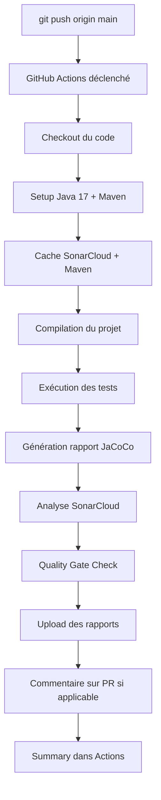

# 📋 Résumé Complet - Intégration SonarCloud

## ✅ Ce qui a été configuré

### 🔧 Fichiers de Configuration
| Fichier | Description | Status |
|---------|-------------|--------|
| `sonar-project.properties` | Configuration principale SonarCloud | ✅ Créé |
| `.sonarcloud.properties` | Configuration alternative | ✅ Créé |
| `pom.xml` | Plugin SonarCloud Maven ajouté | ✅ Modifié |

### 🚀 Workflows GitHub Actions (3 workflows)
| Workflow | Déclenchement | Durée | Description |
|----------|---------------|-------|-------------|
| **sonarcloud.yml** | Push sur main/develop/master/User | 2-5 min | Analyse complète automatique |
| **sonarcloud-pr.yml** | Pull Requests | 2-5 min | Analyse spécifique aux PRs avec commentaires |
| **sonarcloud-test.yml** | Manuel | 2-5 min | Test de configuration |

### 📜 Scripts de Test Local
| Script | Plateforme | Usage |
|--------|-----------|-------|
| `scripts/sonar-local.bat` | Windows | Test local avant push |
| `scripts/sonar-local.sh` | Linux/Mac | Test local avant push |

### 📚 Documentation (7 fichiers)
| Fichier | Contenu | Pour qui |
|---------|---------|----------|
| **START-HERE.md** | 🚀 Démarrage rapide (3 étapes) | Débutants |
| **SONARCLOUD-README.md** | Guide rapide avec exemples | Tous |
| **SONARCLOUD-QUICKSTART.md** | Configuration en 5 minutes | Développeurs |
| **SONARCLOUD-SETUP.md** | Guide complet + troubleshooting | Experts |
| **SONARCLOUD-INTEGRATION.md** | Détails techniques | DevOps |
| **SONARCLOUD-BADGES.md** | Tous les badges disponibles | Documentation |
| **INTEGRATION-COMPLETE.md** | Vue d'ensemble complète | Managers |
| **SONARCLOUD-SUMMARY.md** | Ce fichier - Résumé | Tous |

---

## 🎯 Déclenchement Automatique

### Workflow Principal (`sonarcloud.yml`)

#### 📤 Push vers les branches :
```yaml
- main
- develop
- master
- User
```

#### 🔀 Pull Requests vers :
```yaml
- main
- develop
- master
```

#### 🎯 Manuel :
```
GitHub Actions → "🔍 SonarCloud Analysis" → Run workflow
```

### Workflow PR (`sonarcloud-pr.yml`)

#### 🔀 Pull Requests uniquement :
- Analyse spécifique aux PRs
- Commentaire automatique avec résultats
- Comparaison avec la branche de base

---

## 📊 Ce qui est analysé

### 🐛 Bugs
- Erreurs de code
- Problèmes de logique
- Exceptions non gérées

### 🔒 Vulnerabilities
- Failles de sécurité
- Injections SQL
- XSS, CSRF, etc.

### 💡 Code Smells
- Problèmes de maintenabilité
- Code complexe
- Mauvaises pratiques

### 🔍 Security Hotspots
- Code sensible
- Nécessite revue manuelle
- Authentification, autorisation

### 📈 Coverage
- Couverture de code par les tests
- Lignes couvertes/non couvertes
- Branches couvertes

### 🔄 Duplications
- Code dupliqué
- Pourcentage de duplication
- Blocs similaires

### 📏 Complexity
- Complexité cyclomatique
- Complexité cognitive
- Maintenabilité

---

## 🔧 Configuration Requise

### 1️⃣ Sur SonarCloud
- [x] Compte créé sur [sonarcloud.io](https://sonarcloud.io)
- [x] Projet importé depuis GitHub
- [x] Token généré (Account → Security)
- [x] Organization Key notée

### 2️⃣ Sur GitHub
- [x] Secret `SONAR_TOKEN` ajouté (Settings → Secrets → Actions)

### 3️⃣ Dans les Fichiers
Remplacer `your-org` par votre organization dans :
- [x] `.github/workflows/sonarcloud.yml`
- [x] `.github/workflows/sonarcloud-pr.yml`
- [x] `pom.xml`
- [x] `sonar-project.properties`
- [x] `.sonarcloud.properties`

---

## 🚀 Workflow Automatique Détaillé

### Étape par Étape



### Durée Totale : 2-5 minutes

---

## 📈 Métriques et Seuils

### Quality Gate par Défaut

| Métrique | Seuil | Description |
|----------|-------|-------------|
| **Coverage** | > 80% | Couverture de code recommandée |
| **Duplications** | < 3% | Duplication de code maximale |
| **Maintainability Rating** | A | Note de maintenabilité |
| **Reliability Rating** | A | Note de fiabilité |
| **Security Rating** | A | Note de sécurité |
| **New Code Coverage** | > 80% | Couverture du nouveau code |

### Ratings (A à E)

- **A** : Excellent (0 issues)
- **B** : Bon (1-2 issues mineures)
- **C** : Moyen (3-5 issues)
- **D** : Faible (6-10 issues)
- **E** : Très faible (>10 issues)

---

## 🏆 Badges Recommandés

### Badges Essentiels (4)

```markdown
[](https://sonarcloud.io/dashboard?id=user-microservice)
[](https://sonarcloud.io/dashboard?id=user-microservice)
[](https://sonarcloud.io/dashboard?id=user-microservice)
[](https://sonarcloud.io/dashboard?id=user-microservice)
```

### Badges Complets (10)

Voir `SONARCLOUD-BADGES.md` pour la liste complète.

---

## 🧪 Tests Disponibles

### 1. Test de Configuration (Workflow)
```
GitHub → Actions → "🧪 Test SonarCloud Configuration" → Run workflow
```

**Vérifie** :
- ✅ Secret SONAR_TOKEN configuré
- ✅ Configuration dans les fichiers
- ✅ Compilation du projet
- ✅ Exécution des tests
- ✅ Connexion à SonarCloud

### 2. Test Local (Script)
```bash
# Windows
cd User
scripts\sonar-local.bat VOTRE_SONAR_TOKEN

# Linux/Mac
cd User
chmod +x scripts/sonar-local.sh
./scripts/sonar-local.sh VOTRE_SONAR_TOKEN
```

**Vérifie** :
- ✅ Configuration locale
- ✅ Tests et couverture
- ✅ Analyse SonarCloud
- ✅ Rapport JaCoCo

### 3. Test par Push
```bash
git commit --allow-empty -m "test: trigger SonarCloud"
git push origin main
```

**Vérifie** :
- ✅ Workflow complet
- ✅ Intégration GitHub Actions
- ✅ Résultats sur SonarCloud

---

## 📊 Résultats et Rapports

### Sur GitHub Actions

**Emplacement** : Actions → "🔍 SonarCloud Analysis"

**Contenu** :
- ✅ Logs détaillés de l'analyse
- ✅ Summary avec liens SonarCloud
- ✅ Artifacts (rapports de couverture)
- ✅ Status du Quality Gate

### Sur SonarCloud

**URL** : https://sonarcloud.io/dashboard?id=user-microservice

**Sections** :
- **Overview** : Vue d'ensemble (Quality Gate, métriques principales)
- **Issues** : Liste des bugs, vulnérabilités, code smells
- **Security Hotspots** : Points sensibles nécessitant revue
- **Measures** : Toutes les métriques détaillées
- **Code** : Navigation dans le code avec annotations
- **Activity** : Historique des analyses
- **Pull Requests** : Analyses des PRs

### Sur les Pull Requests

**Commentaire automatique** avec :
- 📊 Lien vers l'analyse détaillée
- 🐛 Nombre de bugs introduits
- 🔒 Vulnérabilités détectées
- 💡 Code smells ajoutés
- 📈 Couverture du nouveau code
- 🎯 Status du Quality Gate

---

## 🔄 Workflow Typique

### Développement d'une Fonctionnalité

```bash
# 1. Créer une branche
git checkout -b feature/ma-fonctionnalite

# 2. Développer
# ... code ...

# 3. Tester localement (optionnel)
scripts\sonar-local.bat VOTRE_TOKEN

# 4. Commiter et pousser
git add .
git commit -m "feat: nouvelle fonctionnalité"
git push origin feature/ma-fonctionnalite

# 5. Créer une Pull Request
# → Analyse automatique ✅
# → Commentaire avec résultats ✅
# → Quality Gate check ✅

# 6. Corriger les issues si nécessaire
# ... corrections ...
git push  # → Nouvelle analyse automatique

# 7. Merger la PR
# → Analyse de la branche principale ✅
```

---

## 🎯 Objectifs de Qualité

### Court Terme (1 mois)
- [ ] Corriger tous les bugs critiques
- [ ] Résoudre les vulnérabilités de sécurité
- [ ] Atteindre 50% de couverture de code

### Moyen Terme (3 mois)
- [ ] Atteindre 70% de couverture de code
- [ ] Réduire les code smells de 50%
- [ ] Maintenir Security Rating A

### Long Terme (6 mois)
- [ ] Atteindre 80% de couverture de code
- [ ] Quality Gate toujours vert
- [ ] Toutes les ratings à A
- [ ] Duplication < 3%

---

## 📚 Ressources

### Documentation Officielle
- 📖 [SonarCloud Docs](https://docs.sonarcloud.io/)
- 📖 [GitHub Actions Integration](https://docs.sonarcloud.io/advanced-setup/ci-based-analysis/github-actions/)
- 📖 [Java Rules](https://rules.sonarsource.com/java/)
- 📖 [Quality Gates](https://docs.sonarcloud.io/improving/quality-gates/)
- 📖 [Metrics Definitions](https://docs.sonarcloud.io/digging-deeper/metric-definitions/)

### Guides Locaux
- 📖 START-HERE.md - Démarrage rapide
- 📖 SONARCLOUD-README.md - Guide rapide
- 📖 SONARCLOUD-QUICKSTART.md - Configuration 5 min
- 📖 SONARCLOUD-SETUP.md - Guide complet
- 📖 SONARCLOUD-INTEGRATION.md - Détails techniques
- 📖 SONARCLOUD-BADGES.md - Badges
- 📖 INTEGRATION-COMPLETE.md - Vue d'ensemble

---

## ✅ Checklist Finale

### Configuration
- [ ] Compte SonarCloud créé
- [ ] Projet importé depuis GitHub
- [ ] Token SonarCloud généré
- [ ] Secret `SONAR_TOKEN` ajouté dans GitHub
- [ ] Organization Key notée

### Fichiers
- [ ] `your-org` remplacé dans `.github/workflows/sonarcloud.yml`
- [ ] `your-org` remplacé dans `.github/workflows/sonarcloud-pr.yml`
- [ ] `your-org` remplacé dans `pom.xml`
- [ ] `your-org` remplacé dans `sonar-project.properties`
- [ ] `your-org` remplacé dans `.sonarcloud.properties`

### Validation
- [ ] Fichiers commités et poussés sur GitHub
- [ ] Workflow "🔍 SonarCloud Analysis" exécuté avec succès
- [ ] Résultats visibles sur SonarCloud
- [ ] Quality Gate configuré
- [ ] Badges ajoutés au README (optionnel)

### Tests
- [ ] Test de configuration exécuté
- [ ] Test local réussi (optionnel)
- [ ] Analyse d'une PR testée
- [ ] Commentaire automatique sur PR vérifié

---

## 🎉 Résultat Final

### Avant
❌ Pas d'analyse de code automatique
❌ Bugs et vulnérabilités non détectés
❌ Pas de métriques de qualité
❌ Pas de feedback sur les PRs

### Après
✅ Analyse automatique à chaque push
✅ Détection des bugs et vulnérabilités
✅ Métriques de qualité en temps réel
✅ Feedback automatique sur les PRs
✅ Quality Gate pour maintenir la qualité
✅ Badges de qualité sur le README
✅ Historique et tendances
✅ Amélioration continue

---

## 📞 Support

### 🐛 Problème ?
1. Consultez `SONARCLOUD-SETUP.md` → Section "Dépannage"
2. Vérifiez les logs dans GitHub Actions
3. Consultez la FAQ dans `SONARCLOUD-INTEGRATION.md`

### 📖 Question ?
1. Consultez la documentation locale
2. Visitez [docs.sonarcloud.io](https://docs.sonarcloud.io/)
3. Consultez [rules.sonarsource.com](https://rules.sonarsource.com/java/)

---

**🎉 Félicitations ! Votre microservice User dispose maintenant d'une analyse de code automatique professionnelle ! 🚀**

---

**Date de création** : $(date)
**Version** : 1.0.0
**Status** : ✅ Prêt à l'emploi
**Prochaine étape** : Consultez `START-HERE.md` pour commencer
